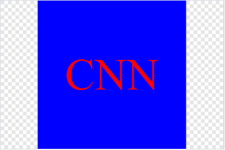
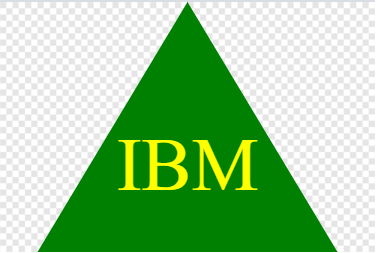

# Desired Logo Generator

## Description 
---

Designing a logo could be a daunting task. This application helps to realize a simple logo using different colors and geometrical shapes in which you can also add a text up to three characters. The shape could be circle, square, or triangle and the color of text and shape can be chosen as desired. The format of the file is SVG.

 

In order to achieve this goal, I took the following steps:

 

1. ask the user about the desired text

2. validate text which should have at least one character and maximum 3 characters, and prompt user if it is not

3. ask the user about the color of the text

5. ask the user select a shape from the list of "Circle", "Square", and "Triangle" 

6. ask the user about the desired color for chosen shape

7. check if the color of text and shape are valid or not, and prompt user if they are not

8. make a logo with the format of SVG as the user has asked for

9. write some test to check the code

 

## Table of Contents
---

* [Description](#description)

* [Installation](#installation)

* [Usage](#usage)

* [Test](#test)

* [Technology Used](#technology-used)

* [Questions](#questions)

* [Credit](#credit)

* [License](#license)

 

## Installation

---

In order to install this application, write the below command in terminal :

npm i

 

## Usage

---

To run the program, enter the below command in console, and then follow the instructions:

node index.js

This is a link to a video which instructs the users on how to work with software : 

[Walk-through Video Link](https://drive.google.com/file/d/11-d7QSgKJo4jceHGlzjDORt8B9_nmhEx/view)

 

Here is the examples of the designed logos by this project:

 

Here is the link of these example logos:

[Click the link here](https://github.com/Bhmerir/desired-logo-generator/tree/main/examples)

 

## Test

---

In order to test the application, run below command :

npm run test

 

## Technology Used

---

| Technology Used         |
| -------------           |
| JavaScript              |  
| Node.js                 |    
| Inquirer Module         | 
| Jest Module             |
| Color Module            |

 

## Questions 

---

If you have any additional questions, you can send me an email to :

[My Email Address](mailto:(mer_ir@yahoo.com))

 

## Credit

---

Name:     Bahareh Hosseini

Github page:      [https://github.com/Bhmerir](https://github.com/Bhmerir)

 

## License

---

MIT License

Copyright (c) 2023 jonnyboy808; CTep09; Bhmerir; osuchaya

Permission is hereby granted, free of charge, to any person obtaining a copy
of this software and associated documentation files (the "Software"), to deal
in the Software without restriction, including without limitation the rights
to use, copy, modify, merge, publish, distribute, sublicense, and/or sell
copies of the Software, and to permit persons to whom the Software is
furnished to do so, subject to the following conditions:

The above copyright notice and this permission notice shall be included in all
copies or substantial portions of the Software.

THE SOFTWARE IS PROVIDED "AS IS", WITHOUT WARRANTY OF ANY KIND, EXPRESS OR
IMPLIED, INCLUDING BUT NOT LIMITED TO THE WARRANTIES OF MERCHANTABILITY,
FITNESS FOR A PARTICULAR PURPOSE AND NONINFRINGEMENT. IN NO EVENT SHALL THE
AUTHORS OR COPYRIGHT HOLDERS BE LIABLE FOR ANY CLAIM, DAMAGES OR OTHER
LIABILITY, WHETHER IN AN ACTION OF CONTRACT, TORT OR OTHERWISE, ARISING FROM,
OUT OF OR IN CONNECTION WITH THE SOFTWARE OR THE USE OR OTHER DEALINGS IN THE
SOFTWARE.

---

© 2023 Confidential and Proprietary. All Rights Reserved.
